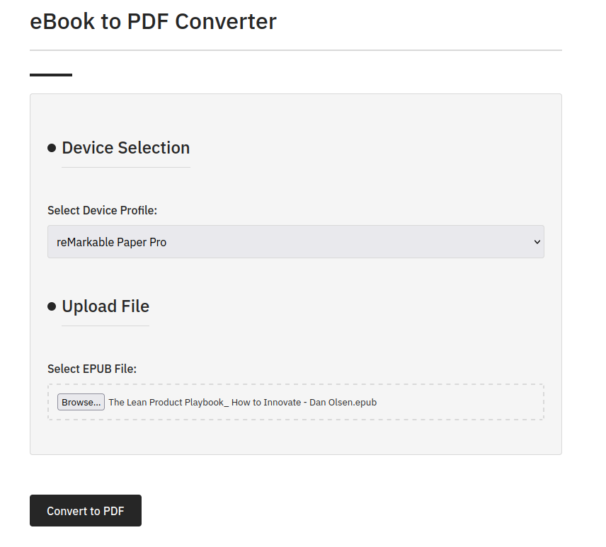
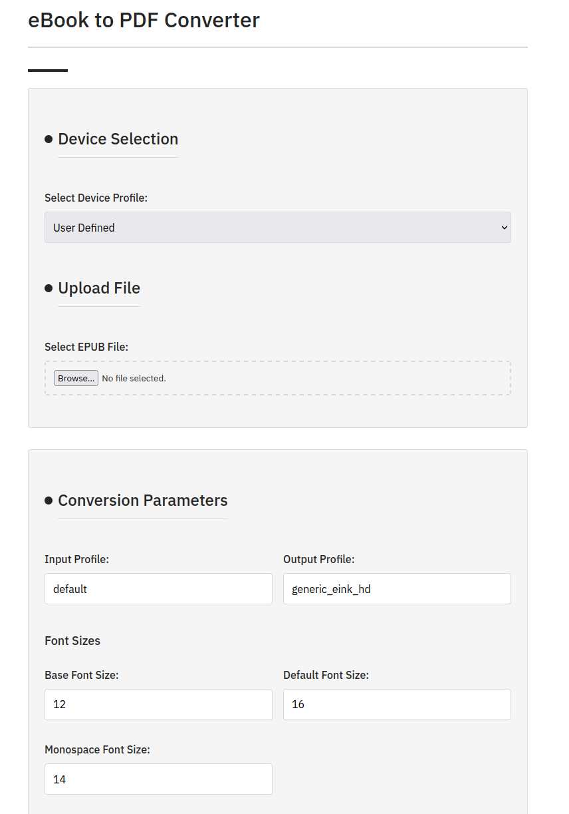
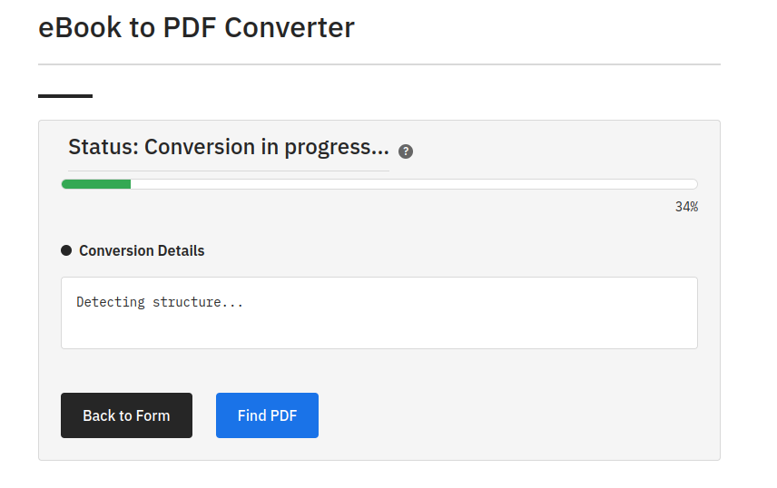
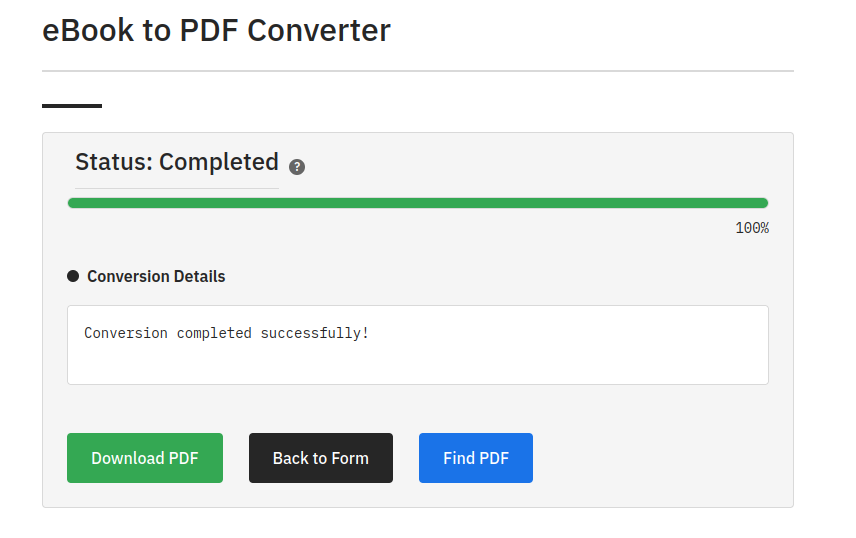

# ePUB to reMarkable Converter
This is a web application to convert epubs into a PDF compatible with the reMarkable Paper Pro and Boox Air 4C.

This project has been heavily influenced by AI tooling of claude.ai.

> [!CAUTION]
> Due to the software architecture and the handling of temporary files and downloads I strongly recommend not to use it as a public webservice.

## Screenshots
### Upload interface

### Custom parameters

### Conversion progress reporting

### Finished conversion


## REST API
This document describes the REST API for the eBook to PDF converter. The API allows you to convert EPUB files to PDF programmatically, check conversion status, and download the converted files.

### API Endpoints

#### Health Check

```
GET /api/v1/health
```

Check if the API and Calibre services are running correctly.

**Response:**

```json
{
  "status": "operational",
  "api_version": "1.0.0",
  "calibre": {
    "status": "available",
    "version": "6.4.0"
  }
}
```

#### Get Device Profiles

```
GET /api/v1/device_profiles
```

Retrieve all available device profiles and their parameters.

**Response:**

```json
{
  "reMarkable": {
    "input_profile": "default",
    "output_profile": "generic_eink_hd",
    "base_font_size": "12",
    ...
  },
  "boox_air_4c": {
    "input_profile": "default",
    "output_profile": "generic_eink_hd",
    "base_font_size": "12",
    ...
  }
}
```

#### Convert EPUB to PDF

```
POST /api/v1/convert
```

Convert an EPUB file to PDF. This is an asynchronous operation that returns a job ID.

**Request:** multipart/form-data

| Parameter | Required | Description |
|-----------|----------|-------------|
| epub_file | Yes | The EPUB file to convert |
| device_profile | No | Device profile to use (reMarkable, boox_air_4c, or custom) |

If using a custom profile, you can include any or all of the following parameters:

- input_profile
- output_profile
- base_font_size
- default_font_size
- mono_font_size
- embed_all_fonts (true/false)
- subset_embedded_fonts (true/false)
- unsmarten_punctuation (true/false)
- custom_size
- unit
- pdf_sans_family
- pdf_serif_family
- pdf_mono_family
- pdf_standard_font
- pdf_page_margin_left
- pdf_page_margin_right
- pdf_page_margin_top
- pdf_page_margin_bottom
- preserve_cover_aspect_ratio (true/false)
- change_justification

**Response:**

```json
{
  "job_id": "550e8400-e29b-41d4-a716-446655440000",
  "status_url": "http://example.com/api/v1/jobs/550e8400-e29b-41d4-a716-446655440000/status",
  "download_url": "http://example.com/api/v1/jobs/550e8400-e29b-41d4-a716-446655440000/download",
  "status": "processing"
}
```

#### Check Conversion Status

```
GET /api/v1/jobs/{job_id}/status
```

Check the status of a conversion job.

**Parameters:**

| Parameter | Type | Description |
|-----------|------|-------------|
| job_id | string | The job ID returned from the convert endpoint |

**Response:**

```json
{
  "status": "running",
  "progress": 45,
  "message": "Converting page 45/100",
  "logs": [
    "Starting conversion...",
    "Converting page 44/100",
    "Converting page 45/100"
  ]
}
```

When the conversion is completed:

```json
{
  "status": "completed",
  "progress": 100,
  "message": "Conversion completed successfully",
  "download_url": "http://example.com/api/v1/jobs/550e8400-e29b-41d4-a716-446655440000/download"
}
```

If the conversion fails:

```json
{
  "status": "failed",
  "progress": 67,
  "message": "Conversion failed with code 1",
  "logs": [
    "Error: Unable to convert page 67",
    "Process terminated abnormally"
  ]
}
```

#### Download Converted PDF

```
GET /api/v1/jobs/{job_id}/download
```

Download the converted PDF file.

**Parameters:**

| Parameter | Type | Description |
|-----------|------|-------------|
| job_id | string | The job ID returned from the convert endpoint |

**Response:**

The PDF file as a binary stream with Content-Type: application/pdf.

### Example Usage

#### Using cURL

```bash
# Health check
curl -X GET http://example.com/api/v1/health

# Get device profiles
curl -X GET http://example.com/api/v1/device_profiles

# Convert EPUB to PDF
curl -X POST http://example.com/api/v1/convert \
  -F "epub_file=@/path/to/book.epub" \
  -F "device_profile=reMarkable"

# Check conversion status
curl -X GET http://example.com/api/v1/jobs/550e8400-e29b-41d4-a716-446655440000/status

# Download converted PDF
curl -X GET http://example.com/api/v1/jobs/550e8400-e29b-41d4-a716-446655440000/download \
  -o converted.pdf
```

#### Using Python

```python
import requests

# Health check
response = requests.get("http://example.com/api/v1/health")
print(response.json())

# Convert EPUB to PDF
with open('/path/to/book.epub', 'rb') as f:
    files = {'epub_file': f}
    data = {'device_profile': 'reMarkable'}
    response = requests.post("http://example.com/api/v1/convert", files=files, data=data)

job_data = response.json()
job_id = job_data['job_id']
print(f"Job ID: {job_id}")

# Check conversion status
status_url = job_data['status_url']
status_response = requests.get(status_url)
print(status_response.json())

# Download converted PDF when ready
if status_response.json()['status'] == 'completed':
    download_url = status_response.json()['download_url']
    pdf_response = requests.get(download_url)
    
    with open('converted.pdf', 'wb') as f:
        f.write(pdf_response.content)
    print("PDF downloaded successfully")
```

### Error Codes

| HTTP Status | Description |
|-------------|-------------|
| 200 | Success |
| 202 | Accepted (for conversion requests) |
| 400 | Bad Request (missing file or invalid parameters) |
| 404 | Not Found (job ID not found) |
| 500 | Server Error |